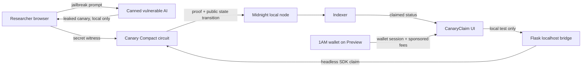

# CanaryClaim

> Privacy-preserving AI vulnerability disclosures on Midnight.

CanaryClaim lets a researcher prove that they know a leaked AI canary without publishing the canary itself. The contract verifies the proof and records a claim; the vulnerable AI interaction and canary remain off-chain.

## Why Midnight

AI security disclosures create a tension: researchers must prove a finding, while publishing the exploit or secret can make the vulnerability worse. CanaryClaim uses a Midnight Compact contract and a private witness so the researcher proves knowledge of the canary without placing it in a transaction argument or ledger field.

## Demo status

The included local demo is end-to-end verified:

- a local Midnight node, indexer, and proof server run in Docker;
- the CLI deploys a contract, generates a ZK proof, and submits `claim()`;
- the contract's public `claimed` state is read back from the indexer;
- the React UI calls a localhost-only bridge and displays the resulting transaction ID;
- the header connects to the 1AM browser wallet on Preview for a real wallet session.

Local mode deploys a disposable contract for each test claim and uses the local development wallet. It is a reproducible demo mode, not a production payout system.

## Privacy boundary

| Data | Where it lives | Public? |
| --- | --- | --- |
| Leaked canary | Researcher's private witness state | No |
| Canary commitment | Contract ledger | Yes |
| Claim status | Contract ledger | Yes |
| Winner public key | Contract ledger after a successful claim | Yes |
| ZK proof and transaction metadata | Midnight transaction | Yes; does not reveal the witness |

The circuit receives no secret argument. It retrieves `secret()` as a witness, hashes it, and asserts that the hash matches the committed canary. Observers can see that the `claim` circuit was called and that a claim succeeded, but cannot recover the witness from the proof.

## Architecture



## Quick start: verified local demo (Windows PowerShell)

Prerequisites: Node.js 22+, Docker Desktop, Python 3.11+, and npm.

```powershell
cd C:\Users\Utpal Kalita\CanaryClaim\canaryClaim
npm install
npm run build --workspace=@eddalabs/counter-contract
npm run build --workspace=@eddalabs/counter-cli
npm run build --workspace=@eddalabs/frontend-vite-react

cd counter-cli
docker compose -f standalone.yml up -d
cd ..\..
python canary-server\server.py
```

In a second terminal:

```powershell
cd C:\Users\Utpal Kalita\CanaryClaim\canaryClaim\frontend-vite-react
npm run dev -- --host 127.0.0.1 --port 5173
```

Open `http://127.0.0.1:5173`, select a bounty, use the jailbreak action, paste the leaked canary, and select **Generate proof**. The UI sends the value only to `http://127.0.0.1:5000/claim`, a localhost bridge that runs the real local Midnight transaction.

### CLI proof check

With the Docker stack running:

```powershell
cd C:\Users\Utpal Kalita\CanaryClaim\canaryClaim\counter-cli
npm run local-claim -- ACME-RESTRICTED-7749
```

Success ends with `LOCAL_CLAIM_RESULT=...` and `claimed: true`.

## 1AM wallet connection

Install and unlock the 1AM browser extension, switch it to **Preview**, then choose **Connect 1AM** in the header. The application uses the Midnight DApp Connector API already bundled in the project and reads wallet configuration dynamically—no network endpoints are hard-coded in the connection flow.

The current wallet connection is intentionally separate from the disposable local proof demo. A production release should add a campaign deployment registry and a token settlement circuit before advertising token payouts.

## Testing

```powershell
cd C:\Users\Utpal Kalita\CanaryClaim\canaryClaim
npm run test-undeployed --workspace=@eddalabs/counter-cli
npm run build --workspace=@eddalabs/frontend-vite-react
python -m py_compile ..\canary-server\server.py
```

## Hackathon demo

Use [DEMO_VIDEO_SCRIPT.md](./docs/DEMO_VIDEO_SCRIPT.md) to record a 75-second submission video. It includes the exact sequence and proof evidence to show.

## Repository layout

```
counter-contract/       Compact canary commitment and claim circuit
counter-cli/            Headless local deploy-and-claim runner
frontend-vite-react/    Researcher UI and 1AM wallet connection
canary-server/          Canned AI target and localhost claim bridge
docs/                   Demo script and submission material
```

## Limitations and next steps

- No token payout is implemented yet; successful claims are verified state transitions.
- Local mode uses a pre-funded development wallet and is not suitable for production.
- The canary itself must be high entropy; a short or predictable secret could be guessed from its public commitment.
- A production campaign should use per-campaign salts/nonces, domain-separated commitments, a deployment registry, and a settlement design reviewed for replay and double-claim risks.
