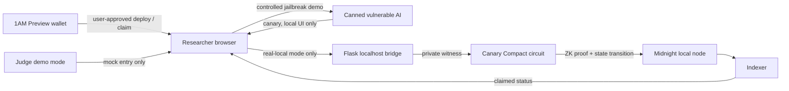

# CanaryClaim

> Privacy-preserving AI vulnerability disclosure on Midnight.

CanaryClaim is a hackathon prototype for proving an AI vulnerability finding without publishing the exploit prompt or disclosed secret. A researcher proves knowledge of a canary with a Midnight zero-knowledge claim circuit; the chain records the commitment and claim state, not the canary.

## The problem

Responsible AI disclosure needs credible proof without turning a vulnerability report into public exploit instructions. CanaryClaim keeps the canary and exploit off-chain while recording a proof-backed claim.

## Implementation status

| Capability | Status | Notes |
| --- | --- | --- |
| Compact canary commitment and one-time claim circuit | Implemented | `claim()` verifies a private witness against a public commitment. |
| Local Midnight deploy, prove, submit, and indexer read-back | Implemented | Runs on the disposable undeployed Docker stack. |
| Canned vulnerable-AI research UI | Implemented | Deliberately insecure hackathon target; not a production AI system. |
| UI-to-local-chain bridge | Implemented | Flask bridge is localhost-only. |
| 1AM Preview wallet connection | Implemented | Wallet approval is required for every transaction. |
| Preview end-to-end wallet transaction | Not yet demonstrated | The repository never deploys automatically. |
| Token reward/payout settlement | Not implemented | A verified claim is not a DUST transfer. |

## Real mode vs judge demo mode

The application has two deliberately separate flows.

### Judge demo mode — enabled by default

Judge demo mode makes presentations reliable. Any value advances through the submission workflow and produces a visible entry labeled **Mock** and **not on-chain**.

It does **not** generate a ZK proof, contact Midnight or a wallet, submit a transaction, or transfer a reward.

### Real local ZK mode

Disable **Judge demo mode** on Submit Proof. The UI then requires the captured canary and sends it only to the local bridge at `http://127.0.0.1:5000/claim`.

The bridge runs a disposable local Midnight transaction that:

1. creates a canary commitment;
2. deploys a fresh contract to the local undeployed network;
3. generates a ZK proof for `claim()` with the canary as private witness data;
4. submits the claim with the local development wallet; and
5. reads `claimed: true` back from the indexer.

This normally takes one to two minutes. Do not run more than one real local claim at once because the disposable local wallet shares DUST coins.

## Privacy model

| Data | Location | Public? |
| --- | --- | --- |
| Exploit prompt and AI interaction | Researcher browser / demo target | No |
| Canary secret | Private witness state | No |
| Canary commitment | Contract ledger | Yes |
| Claim status | Contract ledger | Yes |
| Winner key after a successful claim | Contract ledger | Yes |
| Proof and transaction metadata | Midnight transaction | Yes; the witness remains private |

The circuit accepts no secret transaction argument. It retrieves the secret from a witness, calculates its commitment, and constrains that result to the stored commitment. Observers can see the successful state transition but cannot recover the witness from the ZK proof.

## Architecture



## Repository layout

```text
counter-contract/       Compact source, generated assets, witnesses, and tests
counter-cli/            Headless local wallet, deploy-and-claim runner, Docker config
frontend-vite-react/    React/Vite UI, judge mode, local bridge client, 1AM integration
canary-server/          Canned vulnerable AI and localhost-only claim bridge
docs/                   Judge and video presentation scripts
```

## Prerequisites

- Node.js 22+
- npm
- Docker Desktop
- Python 3.11+
- Optional: 1AM browser extension for Preview testing

## Quick start: judge UI demo

```powershell
cd C:\Users\Utpal Kalita\CanaryClaim\canaryClaim
npm install
npm run build --workspace=@eddalabs/counter-contract
npm run build --workspace=@eddalabs/counter-cli

cd frontend-vite-react
npm run dev -- --host 127.0.0.1 --port 5173
```

Open [http://127.0.0.1:5173](http://127.0.0.1:5173). Select a bounty, open **Submit Proof**, enter any value, and run the mock walkthrough. The resulting entry is explicitly non-chain demo data.

## Run the real local ZK claim

### 1. Start the local Midnight stack

```powershell
cd C:\Users\Utpal Kalita\CanaryClaim\canaryClaim\counter-cli
docker compose -f standalone.yml up -d
```

Services:

- Node: `http://127.0.0.1:9944`
- Indexer: `http://127.0.0.1:8089`
- Proof server: `http://127.0.0.1:6301`

### 2. Start the bridge

```powershell
cd C:\Users\Utpal Kalita\CanaryClaim\canary-server
python server.py
```

### 3. Start the frontend

```powershell
cd C:\Users\Utpal Kalita\CanaryClaim\canaryClaim\frontend-vite-react
npm run dev -- --host 127.0.0.1 --port 5173
```

### 4. Submit the proof

1. Select a bounty and use the canned-AI exploit action to capture the demo canary.
2. Open **Submit Proof**.
3. Disable **Judge demo mode**.
4. Paste the captured canary and choose **Generate proof**.
5. Wait for deployment, proving, submission, and indexer confirmation.

### CLI verification

```powershell
cd C:\Users\Utpal Kalita\CanaryClaim\canaryClaim\counter-cli
npm run local-claim -- ACME-RESTRICTED-7749
```

Success prints:

```text
LOCAL_CLAIM_RESULT={"contractAddress":"…","transactionId":"…","blockHeight":"…","claimed":true}
```

## 1AM Preview wallet

1. Install and unlock 1AM.
2. Select the **Preview** network.
3. Choose **Connect 1AM** in the app header.
4. With a genuine captured secret, use the Preview campaign panel to request deployment or claim submission.
5. Review and approve every action in the wallet.

The app reads configuration through the Midnight DApp Connector API and does not hard-code wallet endpoints. Preview deployment is opt-in; no transaction occurs without the user's wallet approval.

## Development commands

```powershell
npm run build --workspace=@eddalabs/counter-contract
npm run build --workspace=@eddalabs/counter-cli
npm run build --workspace=@eddalabs/frontend-vite-react
npm run test-undeployed --workspace=@eddalabs/counter-cli
python -m py_compile ..\canary-server\server.py
```

## Judge presentation

- [Judge transparency script](./docs/JUDGE_DEMO_SCRIPT.md)
- [Demo video script](./docs/DEMO_VIDEO_SCRIPT.md)

### Honest demo checklist

- State clearly that Judge demo mode is mock-only.
- Show `LOCAL_CLAIM_RESULT` with `claimed:true` as evidence of the real local-chain flow.
- Do not call mock entries blockchain transactions.
- Do not claim a token/DUST payout exists.
- Do not claim a Preview deployment unless a wallet-approved transaction is shown.

## Security notes and next steps

This is a hackathon prototype, not an audited production disclosure platform. A production version should add:

- high-entropy, per-campaign canaries with domain-separated commitments and nonce/salt strategy;
- campaign registry, lifecycle, policy, and ownership controls;
- replay-safe and double-claim-resistant settlement;
- persistent encrypted private-state storage;
- hardened backend operation, authentication, rate limits, and audit logging;
- full Preview and production-network testing.

## Limitations

- The canned AI is intentionally vulnerable and exists only to demonstrate the researcher flow.
- In real local mode, the bridge receives the secret; it must remain localhost-only.
- Each local test deploys a disposable contract.
- Verified claims do not pay bounties.
- The Preview path is wired but still needs a user-approved end-to-end live test.

## License

Apache-2.0 where indicated by package metadata.
